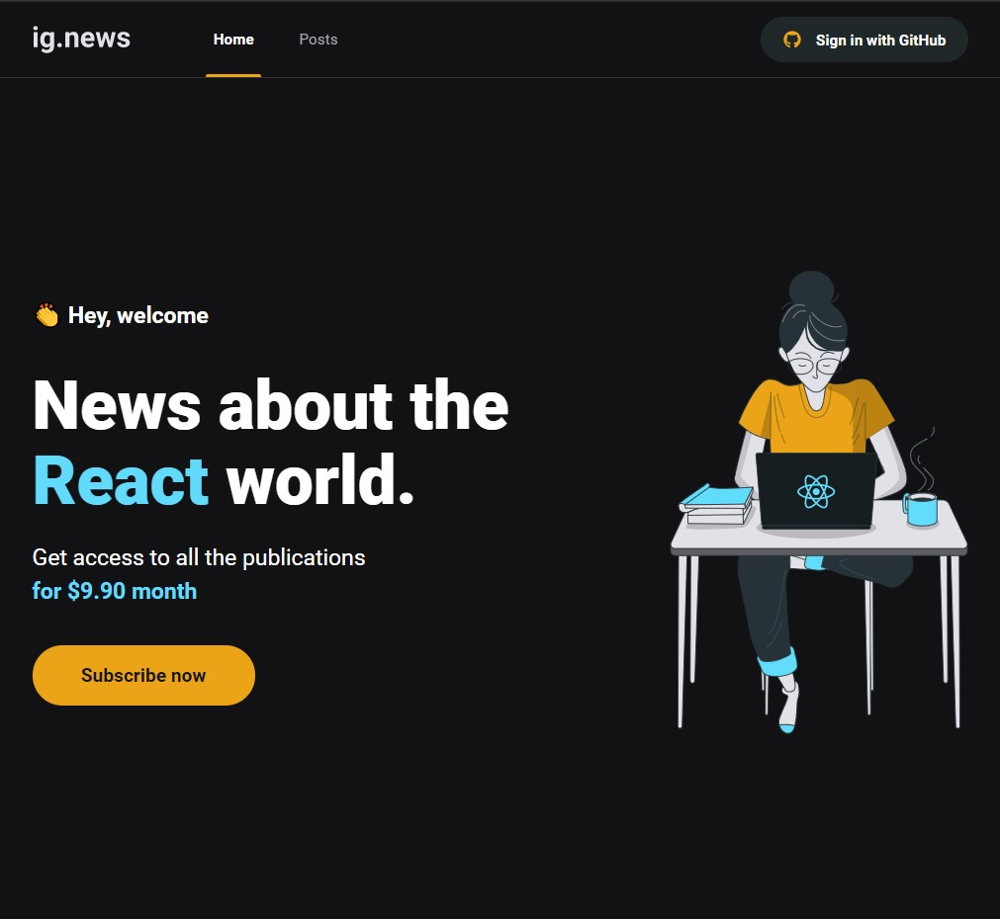
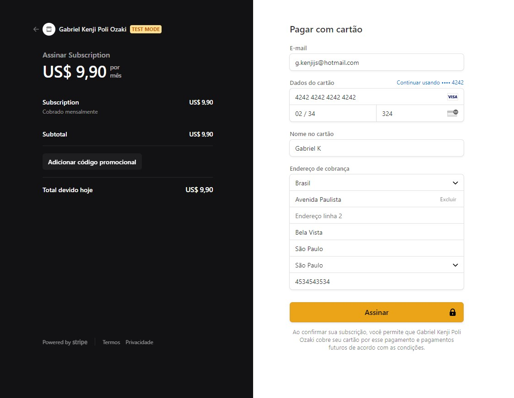
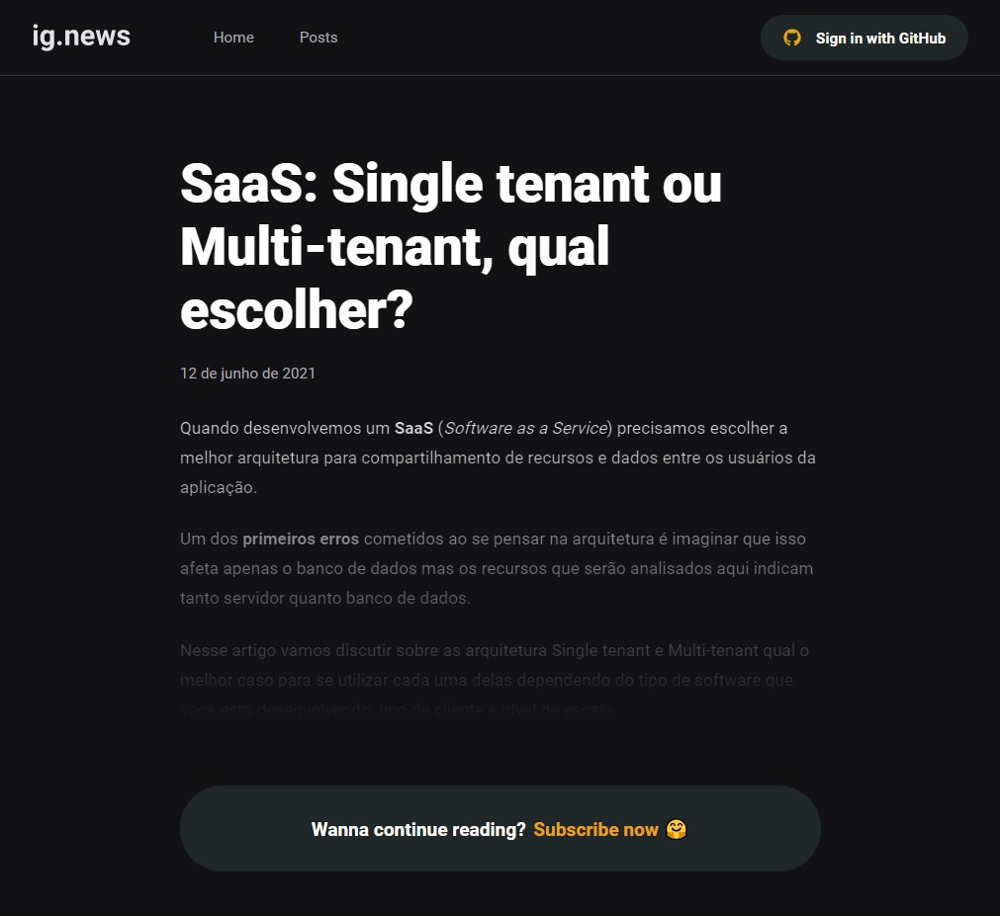
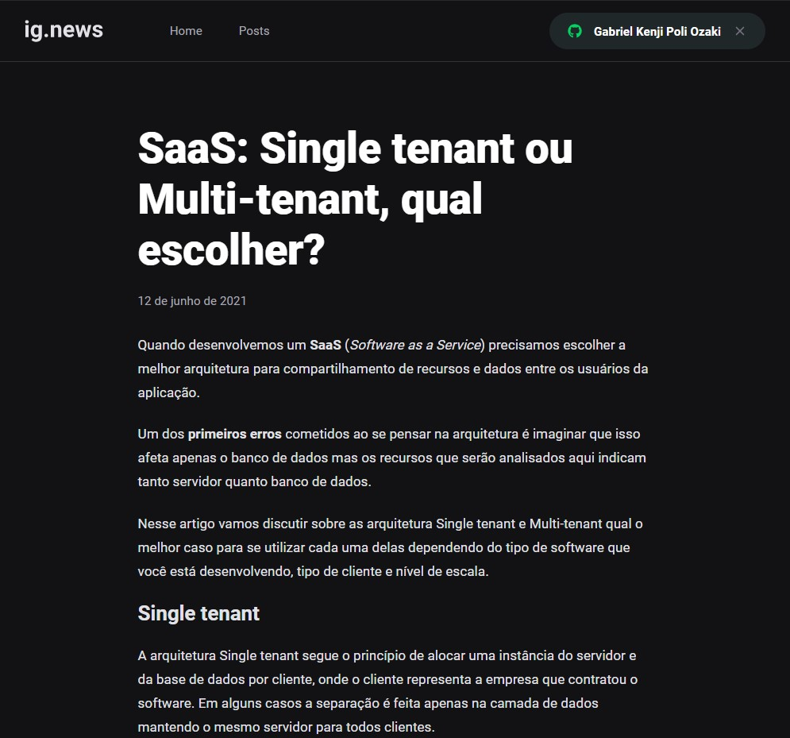

<p align="center">
   
</p>

<p align="center">
 <a href="#projeto">Projeto</a> •
 <a href="#tecnologias">Tecnologias Utilizadas</a> •
 <a href="#execucao">Como Executar</a> •
 <a href="#documentacao">Documentação</a> •
 <a href="#licenca">Licença</a> •
 <a href="#autor">Autor</a> •
 <a href="#contato">Contato</a> 
</p>

--------------------------- 

# :fire: <Strong> Obrigado por visualizar este repositório </Strong> 

<p align="justify"> Primeiramente, olá me chamo Gabriel Kenji Poli Ozaki, sou um estudante de Ciência da Computação e estou querendo atuar na área de Desenvolvimento Web como Desenvolvedor Front-end. </p>

## :computer: <strong id="projeto">Sobre o Projeto </strong>

 
 
 


<p align="justify"><strong>Ig.News</strong> é um app voltado ao <strong>consumo de Blog</strong> contendo Posts com conteúdos para assinantes e prévias para não assinantes, e utilizando Next.js com conceitos de SSG e SSR, gerando mais performance e indexação.<p>

### :pushpin: Funcionabilidades

- [x] Sistema de Login e autenticação atribuídos através da conta do usuário no Github
- [x] Permite o usuário efetuar compra do plano de assinatura (anual ou mensal através do Stripe)
- [x] Aplicação faz um autorreconhecimento no status de assinatura dos usuários
- [x] Somente usuários contendo uma assinatura ativa poderão visualizar o conteúdo completo do Post
- [x] Usuários com uma assinatura não ativa conseguirão visualizar uma prévia do conteúdo no Post

### :triangular_ruler: Layout

<p>Você pode visualizar o layout do projeto através <a href="https://www.figma.com/file/jo6h7zRqOZpnuVii0jqx8T/ig.news">desse link</a>. É necessário ter conta no <a href="https://www.figma.com/">Figma</a> para acessá-lo.</p>

<p align="justify">Essa aplicação Ig.News foi desenvolvida, através do Bootcamp Ignite organizada pela empresa Rocketseat e mentoreado pelo Diego Fernandes na trilha de ReactJS.</p>

## :rocket: <Strong id="tecnologias"> Tecnologias Utilizadas </Strong>

<p align="justify"> Este projeto foi desenvolvido utilizando as seguintes tecnologias: </p>

[](https://reactjs.org/) [](https://nextjs.org/) [](https://stripe.com/br) [](https://fauna.com/) [](https://prismic.io/) [](https://www.typescriptlang.org/) [](https://sass-lang.com/)

<ul>
  <li><a href="https://github.com/axios/axios" rel="nofollow">Axios</a></li>
  <li><a href="https://next-auth.js.org/" rel="nofollow">Next-auth</a></li>
  <li><a href="https://nextjs.org/docs/api-reference/next/router" rel="nofollow">Next/router</a></li>
</ul>

## :runner: <strong id="execucao"> Como executar o projeto </strong>

[](https://classic.yarnpkg.com/en/docs/install/#windows-stable)

```bash
# Fazer o clone do Repositorio.
>> git clone https://github.com/WD-GabrielKenji/Application-Ignews.git
>> cd Application-Ignews >> code .
```
```bash
# Necessario baixar as dependencias necessárias e iniciar o servidor de desenvolvimento:

## Instalar as dependencias: 
>> yarn

## Iniciar o servidor de desenvolvimento:
>> yarn dev
```
```bash
# Criar um arquivo .env.local para armazenar as variaveis de ambiente e insira códigos necessários em cada uma delas:

##Stripe:
>> STRIPE_API_KEY=
>> NEXT_PUBLIC_STRIPE_PUBLIC_KEY=
>> STRIPE_WEBHOOK_SECRET=
>> STRIPE_SUCCESS_URL=
>> STRIPE_CANCEL_URL=

##Github:
>> GITHUB_CLIENT_ID=
>> GITHUB_CLIENT_SECRET=

##FaunaDB:
>> FAUNADB_KEY=

##Prismic CMS:
>> PRISMIC_ENDPOINT=
>> PRISMIC_ACCESS_TOKEN=

# Obs: Necessário reiniciar o servidor de desenvolvimento quanto terminar de inserir as variáveis de ambiente!
```
```bash
# Instalar a CLI do Stripe para verificar os eventos do webhook:

## CLI Stripe: 
>> https://stripe.com/docs/stripe-cli

## Insira em seu Terminal:
>> stripe listen --forward-to localhost:3000/api/webhooks 
```

<pre>
Agora basta acessar <a href="http://localhost:3000" rel="nofollow"><code>localhost:3000</code></a> no seu Browser e usufruir da aplicação!
</pre>

## :book: <strong id="documentacao"> Detalhes aprofundados sobre o projeto </strong>

<details>
<summary>
  Documentação com os detalhes do projeto...
</summary>

<p align="justify"> *Em construção...* </p>

</details>

## :closed_book: <strong id="licenca"> Licença </strong>


Esse projeto esta sob a licença MIT. Veja o arquivo [LICENSE](LICENSE) para mais detalhes.

## :boy: <strong id="autor"> Autor </strong>

<a href="https://github.com/WD-GabrielKenji">
 
 <br />
 <sub><b>Gabriel Kenji Poli Ozaki</b></sub></a> <a href="https://github.com/WD-GabrielKenji" title="Perfil Github"> :star2: 
</a>


Feito de ❤️ por Gabriel Kenji Poli Ozaki - Desenvolvedor Front-end 👋🏽

### :mailbox_with_mail: <strong id="contato"> Redes Sociais para Contato: </strong>

<p> Entre em contato, atraves destas redes sociais: </p>

[](https://www.linkedin.com/in/wdkenji/)  [](https://www.instagram.com/biel.kenjii/)  [](mailto:g.kenjijss@gmail.com)

[](https://github.com/WD-GabrielKenji)
